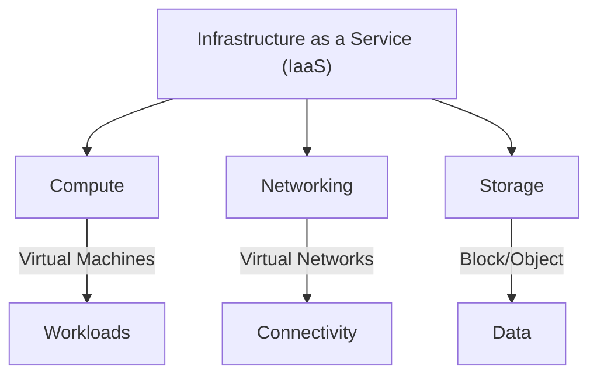
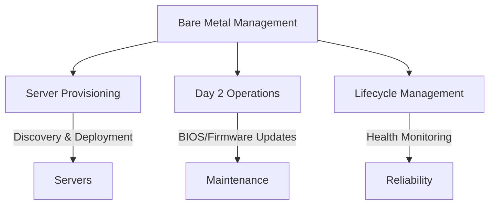
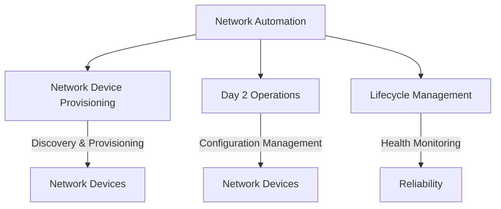

# Overview

IronCore bridges the gap between virtualized infrastructure and physical hardware management, offering a unified 
solution for developers, system administrators, and enterprises. Explore the two core layers below to see how IronCore
can transform your workflows.

## IronCore Architecture

Here's a visual representation of IronCore's two layers. The bare metal management and network automation layers
belong to the infrastructure management domain, while the IaaS layer provides cloud-like capabilities on top.

## Infrastructure as a Service (IaaS)

The IaaS layer provides a flexible, user-friendly environment to create and manage **Compute**, **Networking**, and 
**Storage** resources. With IronCore, you can:

- **Compute**: Spin up virtual machines or containers tailored to your workload needs.
- **Networking**: Configure virtual networks, load balancers, and firewalls with ease.
- **Storage**: Provision scalable block, object, or file storage to suit your applications.

Designed for simplicity and power, this layer abstracts the complexity of resource management, giving you cloud-like 
control at your fingertips.

**[Get Started with IaaS](/iaas/getting-started)** 

**[API References](/iaas/api-references/)**

---

## Bare Metal Management

The Bare Metal Management layer takes server management to the next level, handling everything from provisioning to ongoing maintenance. Key features include:

- **Server Provisioning**: Automate the discovery, configuration, and deployment of bare metal servers.
- **Day 2 Operations**: Simplify maintenance tasks like OS updates, BIOS/firmware upgrades, and hardware diagnostics.
- **Lifecycle Management**: Monitor and manage server health, ensuring peak performance and reliability.

This layer is perfect for those who need fine-grained control over physical hardware without sacrificing automation.

**[Get Started with Bare Metal Management](/baremetal/)**

**[API References](/baremetal/api-references/)**

## Network Automation

The Network Automation layer streamlines the management of network devices and configurations. It offers:

- **Network Device Provisioning**: Automatically discover and provision network devices across your infrastructure.
- **Day 2 Operations**: Manage configurations, updates, and compliance for network devices.
- **Lifecycle Management**: Monitor network device health and performance to ensure optimal operation.

This layer is ideal for network administrators looking to automate and simplify network management tasks.

**[Get Started with Network Automation](/network-automation/)**
